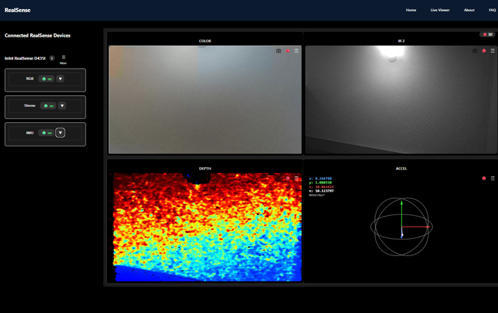

## Demo

[Watch the demo on Google Drive](https://drive.google.com/file/d/1q46vJGoFFjrPOSnUakC3IrsWcuu6iEJV/view?usp=sharing)

# RealSense Web Viewer  

View RealSense streams in your browser.  
**Frontend**: React  
**Backend**: FastAPI  
**Media**: WebRTC  
**Metadata**: Socket.IO  

--- 

### Backend
```bash
cd backend/RealSense-Project
python -m venv .venv
pip install -r requirements.txt
uvicorn main:combined_app --host 0.0.0.0 --port 8000 --reload
```

### Frontend
```bash
cd ../frontend
npm install
npm run dev
```

---

## Open App
[http://localhost:5173](http://localhost:5173)

---

